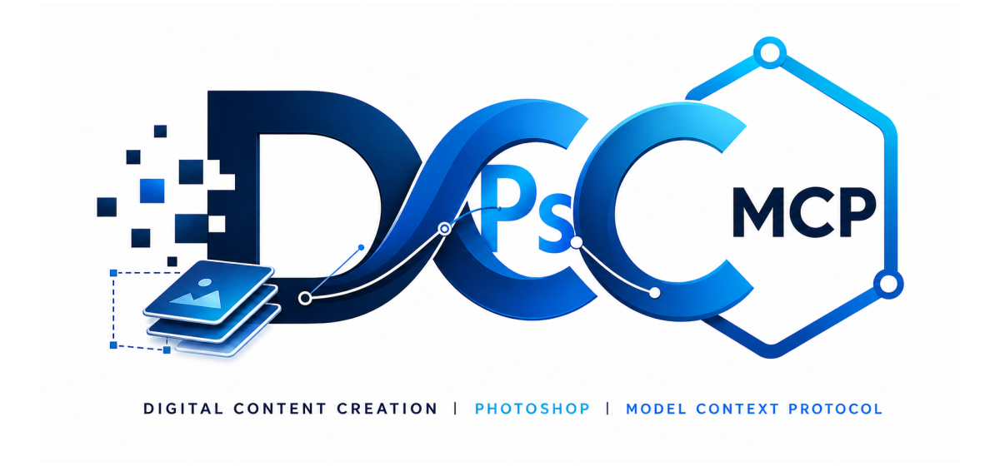

# dcc-mcp-photoshop

<p align="center">
  
</p>

## Agent workflow

AI agents should use the shared gateway through `dcc-mcp-cli`; IDE users may
continue to use the MCP endpoint. Prefer typed skills and tools over raw scripts.

### Install or update the CLI

`dcc-mcp-cli` is the preferred control path for every shell-capable agent. If
it is missing, ask the user before installing the latest official release:

```bash
# Linux/macOS
curl -fsSL https://raw.githubusercontent.com/dcc-mcp/dcc-mcp-core/main/scripts/install-cli.sh | sh

# Windows PowerShell
powershell -ExecutionPolicy Bypass -c "irm https://raw.githubusercontent.com/dcc-mcp/dcc-mcp-core/main/scripts/install-cli.ps1 | iex"
```

Keep an official build current through the release manifest:

```bash
dcc-mcp-cli update check
dcc-mcp-cli update apply
```

`update apply` downloads and stages the latest CLI for the next launch. It
does not update a running `dcc-mcp-server`; update that server in its own
environment.

```bash
dcc-mcp-cli dcc-types
dcc-mcp-cli list
dcc-mcp-cli search --query "<task>" --dcc-type photoshop
dcc-mcp-cli describe <tool-slug>
dcc-mcp-cli call <tool-slug> --json '{"key":"value"}'
```

`dcc-types` reports release-catalog support; `list` reports live sessions. If a
tool belongs to an inactive progressive skill, call `dcc-mcp-cli load-skill <skill-name> --dcc-type photoshop` before retrying. For post-task improvement,
attach a stable session id with `--meta-json`, query `dcc-mcp-cli stats --range 24h --session-id <task-id>`, then pass the bounded evidence to the
`review_skill_improvement` prompt from `dcc-mcp-skills-creator`.


Bring Adobe Photoshop to MCP-native AI agents.

`dcc-mcp-photoshop` turns Photoshop into a standards-compliant **MCP Streamable HTTP** backend via the [adobepy](https://github.com/dcc-mcp/adobepy) Rust broker and UXP bridge. Agents can inspect documents, create and edit layers, apply text, filters, smart objects, selections, export images, and automate Photoshop workflows through typed tools instead of brittle ad-hoc scripts.

The Python MCP server communicates with Photoshop through the adobepy Rust broker (port 47391), which proxies between the Python SDK and the UXP bridge running inside Photoshop.

[](https://github.com/dcc-mcp/dcc-mcp-photoshop/actions/workflows/ci.yml)
[](https://codecov.io/gh/dcc-mcp/dcc-mcp-photoshop)
[](https://github.com/dcc-mcp/dcc-mcp-photoshop/releases)
[](https://github.com/dcc-mcp/dcc-mcp-photoshop/releases)
[](https://github.com/dcc-mcp/dcc-mcp-photoshop/commits/main/)
[](https://github.com/dcc-mcp/dcc-mcp-photoshop/issues)
[](https://github.com/dcc-mcp/dcc-mcp-photoshop/pulls)
[](https://pypi.org/project/dcc-mcp-photoshop/)
[](https://pypistats.org/packages/dcc-mcp-photoshop)
[](https://pepy.tech/project/dcc-mcp-photoshop)
[](https://pypi.org/project/dcc-mcp-photoshop/)
[](https://www.adobe.com/products/photoshop.html)
[](https://modelcontextprotocol.io/)
[](https://github.com/dcc-mcp/dcc-mcp-core)
[](LICENSE)

## Why Use It

| What you get | Why it matters |
|---|---|
| **40+ typed Photoshop tools** across 8 bundled skill packages | Agents can call validated tools for document, layer, image, text, selection, filter, smart object, and script operations. |
| **adobepy Rust broker** | High-performance local proxy between Python SDK and UXP bridge. |
| **Sidecar isolation** | Python MCP server runs outside Photoshop's UI thread; adobepy broker handles all host communication. |
| **Gateway compatible** | Works with `dcc-mcp-server` sidecar for multi-DCC deployments alongside Maya, Houdini, Blender, etc. |
| **Multi-channel distribution** | Available as a PyPI package or standalone adapter binary; the host bridge ships with adobepy. |
| **One-click setup** | The `photoshop-setup` skill automates environment checks, plugin installation, and MCP client configuration. |

## Quick Start

### Prerequisites

1. **adobepy broker** — Install and start the Rust broker:
   ```bash
   cargo install adobepy-cli
   adobepy broker
   ```

2. **adobepy UXP bridge** — Install in Photoshop:
   ```bash
   adobepy install-bridge photoshop --dest ./adobepy-photoshop-bridge
   ```
   Enable Developer Mode in Photoshop, add the generated `manifest.json` to
   Adobe UXP Developer Tool, and click **Load**.

### 1. Install dcc-mcp-photoshop

### 2. Configure your MCP client

Point your MCP client to the **gateway URL**. The gateway auto-discovers which DCC (Photoshop, Maya, etc.) to route each tool call to, so you only need one endpoint:

```json
{
  "mcpServers": {
    "photoshop": {
      "url": "http://127.0.0.1:9765/mcp"
    }
  }
}
```

### 3. Smoke test

```text
Search for Photoshop tools, load the photoshop-document skill, and list layers in the current document.
```

## Architecture

```
AI Agent (Claude Desktop / Cursor / Copilot)
    │  MCP Streamable HTTP (gateway port 9765)
    ▼
dcc-mcp-server Gateway
    │  auto-discovers DCC via capability index
    ▼
PhotoshopMcpServer  [Python sidecar]
    │  HTTP JSON-RPC (port 47391)
    ▼
adobepy Rust Broker  [adobepy broker]
    │  WebSocket (port 47391)
    ▼
adobepy UXP Bridge  [bridges/uxp/photoshop/, TypeScript]
    │  Photoshop UXP API
    ▼
Adobe Photoshop 2022+
```

**Key architectural decisions:**
- The **adobepy Rust broker** (port 47391) is the central hub — Python SDK and UXP bridge both connect to it.
- Python MCP instances use OS-assigned ports; skill scripts use `adobe.photoshop.Photoshop()` facade to call the broker.
- The adobepy UXP bridge (`bridges/uxp/photoshop/`) handles all Photoshop DOM operations with 60+ typed methods.
- All Photoshop automation goes through the [adobepy](https://github.com/dcc-mcp/adobepy) facade layer, which abstracts over the broker.

## Tool Surface

Skills are **lazy-loaded**: only meta-tools are available initially. Use `load_skill` to expand:

```
search_skills / dcc_capability_manifest
  -> load_skill("photoshop-document")
  -> list_layers(...)
```

### photoshop-document

Document information, listing, and lifecycle management.

| Tool | Description | Read-only |
|------|-------------|-----------|
| `get_document_info` | Get metadata about the active Photoshop document (name, size, resolution, color mode) | ✅ |
| `list_documents` | List all currently open Photoshop documents with metadata | ✅ |
| `open_document` | Open an existing local image or Photoshop document and make it active | ❌ |
| `list_layers` | List all layers in the active document. Set `include_hidden=false` to exclude hidden layers | ✅ |
| `close_document` | Close a Photoshop document by ID or the active document | ❌ |

### photoshop-image

Document creation, export, canvas/image resize, flatten, and merge operations.

| Tool | Description | Read-only |
|------|-------------|-----------|
| `create_document` | Create a new document with specified dimensions, resolution and color mode | ❌ |
| `export_document` | Export the active document to PNG, JPG, TIFF, or PSD | ❌ |
| `save_document` | Save the active document in its current format | ❌ |
| `resize_canvas` | Resize canvas without scaling content | ❌ |
| `resize_image` | Scale the image (resamples content) | ❌ |
| `flatten_image` | Flatten all layers into a single background layer | ❌ |
| `merge_visible_layers` | Merge all visible layers | ❌ |

### photoshop-layers

Full CRUD for layers plus visual property changes.

| Tool | Description | Read-only |
|------|-------------|-----------|
| `create_layer` | Create a pixel, group, or adjustment layer | ❌ |
| `delete_layer` | Delete a named layer | ❌ |
| `duplicate_layer` | Duplicate a named layer | ❌ |
| `rename_layer` | Rename a layer | ❌ |
| `set_layer_opacity` | Set opacity (0-100) of a named layer | ❌ |
| `set_layer_visibility` | Show or hide a named layer | ❌ |
| `set_layer_blend_mode` | Set blend mode (normal, multiply, screen, overlay, etc., 27 modes) | ❌ |
| `fill_layer` | Fill a layer with solid color (hex) or transparent | ❌ |

### photoshop-text

Text layer creation, editing, and inspection.

| Tool | Description | Read-only |
|------|-------------|-----------|
| `create_text_layer` | Create a new text layer with content and styling (font, size, color, alignment) | ❌ |
| `update_text_layer` | Update text content or style of an existing text layer | ❌ |
| `get_text_layer_info` | Get text content and style properties of a text layer | ✅ |

### photoshop-selection

Selection creation, modification, and saving.

| Tool | Description | Read-only |
|------|-------------|-----------|
| `get_selection` | Get current selection bounds (top, left, bottom, right) | ✅ |
| `select_all` | Select the entire canvas | ❌ |
| `deselect` | Deselect any active selection | ❌ |
| `select_rectangle` | Create a rectangular selection (top, left, bottom, right in pixels) | ❌ |
| `select_ellipse` | Create an elliptical selection | ❌ |
| `inverse_selection` | Invert the current selection | ❌ |
| `expand_selection` | Expand selection by N pixels | ❌ |
| `contract_selection` | Contract selection by N pixels | ❌ |
| `feather_selection` | Feather selection by N pixels | ❌ |
| `save_selection` | Save selection as a named alpha channel | ❌ |

### photoshop-filter

Apply filters to layers.

| Tool | Description | Read-only |
|------|-------------|-----------|
| `apply_gaussian_blur` | Apply Gaussian Blur (radius in pixels) | ❌ |
| `apply_high_pass` | Apply High Pass filter (radius in pixels) | ❌ |
| `apply_sharpen` | Apply Sharpen filter | ❌ |
| `apply_smart_blur` | Apply Smart Blur (radius + threshold) | ❌ |
| `apply_filter` | Generic filter by method name with arguments | ❌ |

### photoshop-smart-object

Smart Object operations for non-destructive editing.

| Tool | Description | Read-only |
|------|-------------|-----------|
| `convert_to_smart_object` | Convert the active layer to a Smart Object | ❌ |
| `new_smart_object_via_copy` | Create a new Smart Object by duplicating the active layer | ❌ |
| `edit_smart_object_contents` | Open the Smart Object for editing | ❌ |
| `replace_smart_object_contents` | Replace Smart Object contents with an external file | ❌ |

### photoshop-script

Execute named Photoshop Actions for advanced automation.

| Tool | Description | Read-only |
|------|-------------|-----------|
| `execute_action` | Execute a named Photoshop Action from an Action Set | ❌ |

### photoshop-adjustment

Channel operations and low-level batchPlay access.

| Tool | Description | Read-only |
|------|-------------|-----------|
| `batch_play` | Execute raw ActionDescriptor batchPlay commands | ❌ |
| `get_channels` | Get channel information for the active document | ✅ |
| `add_channel` | Add a new alpha channel | ❌ |
| `remove_channel` | Remove a named channel | ❌ |

## Runtime Features

| Feature | Surface |
|---|---|
| Capability manifest | `dcc_capability_manifest({"loaded_only": false})` returns a compact index of loaded and unloaded Photoshop skills. |
| adobepy broker | Local Rust proxy (port 47391) with session management and timeout control. |
| Persistent logging | Logs written to `~/.dcc-mcp/logs/` (configurable via `DCC_MCP_PHOTOSHOP_LOG_DIR`). |
| Lazy skill loading | `load_skill` meta-tool expands the tool surface on demand. |

## One-Click Installer

The `photoshop-setup` skill provides a complete installer workflow that automates environment checks, package installation, UXP plugin setup, and MCP client configuration.

```
load_skill("photoshop-setup")
```

### Tools

| Tool | Description |
|------|-------------|
| `check_environment` | Check system prerequisites (Python, pip, Photoshop) |
| `install_package` | Install or upgrade dcc-mcp-photoshop via pip |
| `setup_uxp_plugin` | Stage the adobepy bridge and provide explicit UXP Developer Tool loading steps |
| `start_server` | Start server in dev mode for testing |
| `verify_connection` | Verify bridge connection to Photoshop |
| `configure_mcp_client` | Auto-configure MCP client configs for Claude Desktop, Cursor, VS Code |

### Standard Install Flow

```text
check_environment → install_package → setup_uxp_plugin → configure_mcp_client → verify_connection
```

1. **check_environment** — Verifies Python, pip, and Photoshop are available.
2. **install_package** — Installs `dcc-mcp-photoshop` and dependencies from PyPI.
3. **setup_uxp_plugin** — Generates the adobepy bridge files. Adobe UXP Developer Tool performs the explicit host load.
4. **configure_mcp_client** — Sets up `mcpServers` entries for Claude Desktop, Cursor, and VS Code.
5. **verify_connection** — Confirms the bridge is connected and Photoshop responds.

### Installing a Specific Version

Pin to a specific version for compatibility with your existing dcc-mcp-core deployment:

```text
install_package(version="0.1.14")
```

### Upgrading

Upgrade `dcc-mcp-photoshop` and its dependencies to the latest version on PyPI:

```text
install_package(upgrade=True)
```

### Rolling Back

Install a previous adapter version to roll back from a regression. The adobepy broker and bridge use their own release version:

```text
install_package(version="0.1.13")
```

### Uninstalling

Remove the Python package via pip:

```bash
pip uninstall dcc-mcp-photoshop
```

Remove the generated bridge directory after unloading it from Adobe UXP Developer Tool:

```powershell
# Windows
Remove-Item -Recurse "$env:LOCALAPPDATA\adobepy\bridges\photoshop"
```

```bash
# macOS
rm -rf ~/.local/share/adobepy/bridges/photoshop
```

## Installation

### PyPI

```bash
pip install dcc-mcp-photoshop
```

Or via `uvx`:

```bash
uvx --with dcc-mcp-photoshop dcc-mcp-photoshop --gateway-port 9765
```

From source:

```bash
git clone https://github.com/dcc-mcp/dcc-mcp-photoshop.git
cd dcc-mcp-photoshop
pip install -e ".[dev]"
```

### Standalone Binary

Each [GitHub Release](https://github.com/dcc-mcp/dcc-mcp-photoshop/releases) includes platform-specific binaries built with PyOxidizer. No Python runtime required.

| Platform | Binary name |
|----------|-------------|
| Windows | `dcc-mcp-photoshop-windows.exe` |
| Linux | `dcc-mcp-photoshop-linux` |
| macOS | `dcc-mcp-photoshop-macos` |

```bash
# Download the latest release binary (example: Linux)
curl -LO https://github.com/dcc-mcp/dcc-mcp-photoshop/releases/latest/download/dcc-mcp-photoshop-linux
chmod +x dcc-mcp-photoshop
./dcc-mcp-photoshop --help
```

### adobepy UXP Bridge

Generate the bridge from an adobepy release bundle:

```powershell
adobepy install-bridge photoshop --dest "$env:LOCALAPPDATA\adobepy\bridges\photoshop"
```

Enable Photoshop Developer Mode, open Adobe UXP Developer Tool, add the
generated `manifest.json`, and click **Load**. Copying an unpacked development
plugin into an Adobe plugin directory does not register or load it.

## Configuration

### MCP Client Configuration

#### Claude Desktop

```json
{
  "mcpServers": {
    "photoshop": {
      "url": "http://127.0.0.1:9765/mcp"
    }
  }
}
```

The gateway URL (`:9765`) is a unified facade that aggregates tools from all registered DCCs. On `tools/call`, the gateway auto-discovers the correct DCC instance via the capability index — no need to specify the DCC type in the URL.

#### Cursor

In Cursor Settings → Features → MCP Servers:

```
Name: photoshop
Type: url
URL: http://127.0.0.1:9765/mcp
```

#### VS Code (via MCP extension)

```json
{
  "mcp": {
    "servers": {
      "photoshop": {
        "type": "http",
        "url": "http://127.0.0.1:9765/mcp"
      }
    }
  }
}
```

### Environment Variables

| Variable | Description | Default |
|----------|-------------|---------|
| `ADOBEPY_BROKER_URL` | adobepy broker HTTP endpoint | `http://127.0.0.1:47391` |
| `ADOBEPY_TOKEN` | Broker authentication token | `dev-token` |
| `ADOBEPY_TARGET` | Broker target identifier | `default` |
| `DCC_MCP_PHOTOSHOP_PORT` | Optional fixed MCP instance port | `0` (OS-assigned) |
| `DCC_MCP_GATEWAY_PORT` | Gateway competition port | — |
| `DCC_MCP_PHOTOSHOP_LOG_DIR` | Log directory | `~/.dcc-mcp/logs` |
| `DCC_MCP_PHOTOSHOP_LOG_LEVEL` | Log level (DEBUG/INFO/WARNING/ERROR) | `INFO` |
| `DCC_MCP_PHOTOSHOP_TIMEOUT` | Operation timeout in seconds | `30.0` |
| `DCC_MCP_REGISTRY_DIR` | Shared FileRegistry directory for gateway discovery | `~/.dcc-mcp/registry` |
| `DCC_MCP_PHOTOSHOP_SKILL_PATHS` | Extra skill directories (colon-separated) | — |
| `DCC_MCP_SKILL_PATHS` | Global extra skill directories | — |

## Bridge Protocol

The Python ↔ Photoshop communication goes through the adobepy Rust broker using the adobepy protocol (v0.2.0). The broker handles JSON-RPC 2.0 routing, session management, and timeout control.

For protocol details, see the [adobepy protocol contract](https://github.com/dcc-mcp/adobepy/blob/main/contracts/adobepy_protocol_contract.json).

## Skill Authoring

Skills use the [adobepy](https://github.com/dcc-mcp/adobepy) facade layer:

```python
from adobe.dcc_mcp import action_result
from adobe.photoshop import Photoshop
from dcc_mcp_core.skill import skill_entry


@skill_entry
def list_layers(**kwargs) -> dict:
    """List all layers in the active Photoshop document."""
    app = Photoshop()
    return action_result(
        "Listed active Photoshop layers",
        lambda: {"layers": [layer.name for layer in app.activeLayers]},
        prompt="Use the layer names in the next Photoshop operation.",
    )


def main(**kwargs):
    return list_layers(**kwargs)


if __name__ == "__main__":
    from dcc_mcp_core.skill import run_main
    run_main(main)
```

### Skill directory structure

```
skills/
├── photoshop-document/
│   ├── SKILL.md
│   └── scripts/
├── photoshop-image/
│   ├── SKILL.md
│   └── scripts/
├── photoshop-layers/
│   ├── SKILL.md
│   └── scripts/
├── photoshop-text/
│   ├── SKILL.md
│   └── scripts/
├── photoshop-selection/
│   ├── SKILL.md
│   └── scripts/
├── photoshop-filter/
│   ├── SKILL.md
│   └── scripts/
├── photoshop-smart-object/
│   ├── SKILL.md
│   └── scripts/
├── photoshop-script/
│   ├── SKILL.md
│   └── scripts/
└── photoshop-adjustment/
    ├── SKILL.md
    └── scripts/
```

### Setting custom skill paths

```bash
export DCC_MCP_PHOTOSHOP_SKILL_PATHS=/path/to/my/skills
dcc-mcp-photoshop --skill-paths /path/to/my/skills
```

## CLI Reference

```
dcc-mcp-photoshop [OPTIONS]

Options:
  --mcp-port PORT     Optional fixed MCP instance port (default: OS-assigned)
  --broker-url URL    adobepy broker URL (default: http://127.0.0.1:47391)
  --gateway-port PORT Gateway competition port
  --server-name NAME  Server name in MCP initialize (default: photoshop-mcp)
  --skill-paths PATH  Extra skill directories
  --no-builtins       Do not discover built-in skills
  --verbose, -v       Enable debug logging
  --version           Show version and exit
```

## Python API

```python
import dcc_mcp_photoshop

handle = dcc_mcp_photoshop.start_server(broker_url="http://127.0.0.1:47391")
print(f"MCP URL: {handle.mcp_url()}")

# ... use with Claude Desktop, Cursor, etc.

handle.shutdown()
```

## Ports

| Port | Service | Description |
|------|---------|-------------|
| 47391 | adobepy broker | Rust broker HTTP/WS endpoint (Python SDK ↔ UXP bridge) |
| OS-assigned | MCP instance | Direct Streamable HTTP endpoint discovered through CLI/gateway |
| 9765 | Gateway | Optional multi-DCC gateway proxy |

## Gateway Mode (Recommended for Deployment)

This mode uses the standalone `dcc-mcp-server` for the MCP server with the adobepy broker as the Photoshop communication layer.

**Terminal 1** — Start the adobepy broker:
```bash
adobepy broker
```

**Terminal 2** — Start the MCP server:
```bash
dcc-mcp-photoshop --broker-url http://127.0.0.1:47391
```

**MCP clients** connect to the gateway URL:
- `http://127.0.0.1:9765/mcp` — Gateway proxy (recommended)
- `dcc-mcp-cli list` — discover direct instance URLs

## UXP Bridge Setup

The UXP bridge is part of the adobepy project. To install:

```bash
adobepy install-bridge photoshop --dest ./adobepy-photoshop-bridge
```

This stages the bridge files only. Enable Photoshop Developer Mode, add the
generated `manifest.json` in Adobe UXP Developer Tool, and click **Load**.

For development, load from source:
1. Open Photoshop
2. Go to **Plugins** → **Development** → **Load Plugin...**
3. Navigate to adobepy's `bridges/uxp/photoshop/` and select `manifest.json`

### Bridge manifest

The bridge manifest is at `bridges/uxp/photoshop/manifest.json` in the adobepy repository:

| Field | Value |
|-------|-------|
| Plugin ID | `com.adobepy.bridge.photoshop` |
| Name | `Adobe Python Bridge` |
| Host app | Photoshop (PS), min version 25.0.0 |
| Network permissions | All domains (required for WebSocket to broker) |
| Local file system | Request (user consent per operation) |

## Development

```bash
git clone https://github.com/dcc-mcp/dcc-mcp-photoshop.git
cd dcc-mcp-photoshop
pip install -e ".[dev]"
pytest tests/
```

## Requirements

- **Photoshop**: Adobe Photoshop 2022+ (UXP support required)
- **Python** (pip path only): Python 3.8+
- **Dependencies** (auto-installed with pip):
  - `dcc-mcp-core >= 0.19.45, < 1.0.0`
  - `adobepy >= 0.1.0`
  - `websockets >= 12.0`
- **Build** (to build standalone binary from source): Python 3.8+, [Rust toolchain](https://rustup.rs/), and PyOxidizer (`pip install pyoxidizer`)

| Path | Photoshop Required? | Python Required? |
|------|-------------------|-----------------|
| pip install | Yes (UXP plugin) | Yes |
| Standalone binary | Yes (UXP plugin) | No |
| adobepy bridge template | Yes | No |

## Version Compatibility

| dcc-mcp-photoshop | dcc-mcp-core | adobepy | Sidecar Binary |
|-------------------|-------------|---------|----------------|
| current main | >=0.19.45,<1.0.0 | >=0.1.0 | dcc-mcp-server >=0.19.45 |
| 0.1.0-0.1.26 | >=0.12.14,<1.0.0 | >=0.1.0 | dcc-mcp-server >=0.12.14 |

## Distribution

Release artifacts per version:
- `dcc-mcp-photoshop-<version>-py3-none-any.whl` — Python wheel
- `dcc-mcp-photoshop-<version>.tar.gz` — Python sdist
- `dcc-mcp-photoshop-windows.exe` — Windows binary
- `dcc-mcp-photoshop-linux` — Linux binary
- `dcc-mcp-photoshop-macos` — macOS binary

## Roadmap

### v0.1.0 — Foundation ✅
- Package structure and API design
- PhotoshopBridge WebSocket client scaffold
- Skill authoring helpers

### v0.2.0 — adobepy Integration ✅
- adobepy Rust broker integration (port 47391)
- Python SDK facade (adobe.photoshop)
- 40+ Photoshop skills across 8 packages
- Selection, filter, smart object, script, adjustment tools
- UXP code convergence (removed old bridge/uxp-plugin/)
- Configuration externalization (config.py)

### v0.3.0 — Skills & Polish (next)
- Color adjustments (levels, curves, hue/saturation)
- Layer styles and effects
- Batch processing workflows
- Performance optimizations

### v1.0.0 — Production Ready
- Photoshop 2025+ UXP API compatibility
- Authentication and security hardening
- E2E test coverage

## Troubleshooting

### Broker not reachable

```
adobepy broker not reachable at http://127.0.0.1:47391
```

1. Start the broker: `adobepy broker`
2. Verify the broker is running: `curl http://127.0.0.1:47391/v1/capabilities`
3. Check the `ADOBEPY_BROKER_URL` environment variable matches the broker endpoint

### UXP bridge not connecting

1. Ensure Photoshop 2024+ (min version 25.0.0) is running
2. Run `adobepy install-bridge photoshop` and restart Photoshop
3. Check the bridge is loaded: **Plugins** → **Adobe Python Bridge**

### No active document error

If skills return "No active document":
1. Open a document in Photoshop (File → New or File → Open)
2. Retry the skill call

### Default ports used

| Port | Service |
|------|---------|
| 47391 | adobepy Rust broker |
| OS-assigned | MCP instance |
| 9765 | Gateway competition port |

## Contributing

Contributions are especially welcome from those with:
- Adobe UXP / ExtendScript experience
- Photoshop automation knowledge
- WebSocket and JSON-RPC protocol experience

See [CONTRIBUTING.md](CONTRIBUTING.md) for guidelines.

## License

MIT — see [LICENSE](LICENSE).
